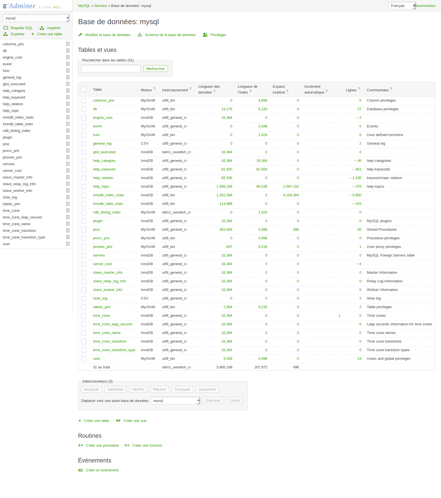

# adminer-packed
adminer packed with theme and plugins

## Summarry
- [what's included](#what-s-included)  
- [installation](#installation)  
- [screenshots](#screenshots)  


## what's included
- [adminer](https://github.com/vrana/adminer)
- [adminer-theme](https://github.com/pematon/adminer-theme) green
- official plugins enabled :
    - dump-bz2
- unofficial plugins added and enabled
    - none
    


## installation

###clone
```
git clone --recursive https://github.com/olaulau/adminer-packed
```

### generate / update

```
cd adminer-packed
./make.sh
cd ..
sudo cp -R adminer-packed/dist /var/ww/html/adminer
```
--> [http:/localhost/adminer/](http:/localhost/adminer/)


## screenshots

